## Introduction
---
While browsing YouTube, I had the pleasure of stumbling upon the [video about Shell Texturing](https://www.youtube.com/watch?v=9dr-tRQzij4) made by *Acerola* [1], where he explains how hard it is to render and simulate hair. On average, humans have between `90.000` and `150.000` hairs on their head [2], so just imagine how geometrically complex a physically accurate hair simulation would be.

This immediately caught my curiosity, because I asked myself: *"How is it that for years there have been video games that managed to render hair or fur on hardware significantly less efficient than today's (2024), when it seems like such a complex thing to pull off?"*. So I set out to watch the video, implement this *illusion* of fur in the *Unity* game engine, and write this record of my exploration, where I will go into detail and dissect this effect step by step to add my two cents. I hope you enjoy it!

## Hashing
---
Our first goal will be to generate a grid of cells with pseudo-random values (deterministic but hard to predict) in \\([0, 1]\\) across the surface of our mesh.

To solve the generation of pseudo-random values we can use a *hash* function.

```glsl
// Thanks to Hugo Elias
float hash(uint n) {
	n = (n << 13u) ^ n;
	n = n * (n * n * 15731u + 0x789221u) + 0x1376312589u;
	
	return float(n & uint(0x7fffffffu)) / float(0x7fffffff);
}
```

The first two operations of the hash function are beyond the scope of this blog. However, if we analyze the return operation, we can see that an `and(&)` operation is performed on `n` and `0x7fffffffu`.

`0x7fffffffu` is an integer with almost all of its bits set to `1`, the only exception being the sign bit, which is `0` since this is a **positive** number.

Let's run the operation to analyze its behavior.
```
  0111 1111 1111 1111 1111 1111 1111 1111  // 0x7fffffffu
& 1010 1011 1001 1100 1010 1011 1110 0011  // random negative number
‾‾‾‾‾‾‾‾‾‾‾‾‾‾‾‾‾‾‾‾‾‾‾‾‾‾‾‾‾‾‾‾‾‾‾‾‾‾‾‾‾
  0010 1011 1001 1100 1010 1011 1110 0011  // same number but positive
```

With this example, we can conclude that the purpose of this operation is to get the absolute value of `n`.

Then, by dividing the absolute value of `n` by `0x7fffffffu` (the largest possible value `n` can take), we are **normalizing** `n`, so the **range** of the `hash` function is \\((0 \leq n \leq 1)\\).

## Generating the grid
---

The goal now is to create a grid whose cells each have an associated pseudo-random value in \\([0, 1]\\). Let's see how to do this step by step.

If we return `uv.x` in the red channel of the fragment shader we get this output:
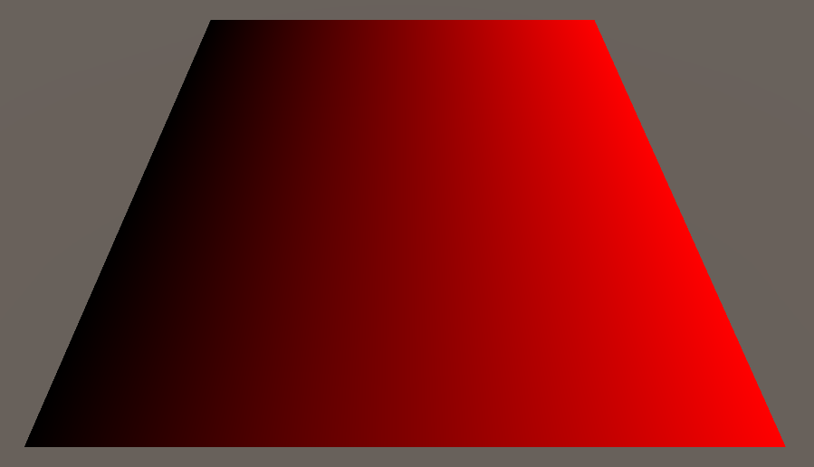
*Figure 2. x axis of the uv coordinates.*

Next, we divide the space into integer values by computing the `floor()` of `uv.x`, which gives us the following result:

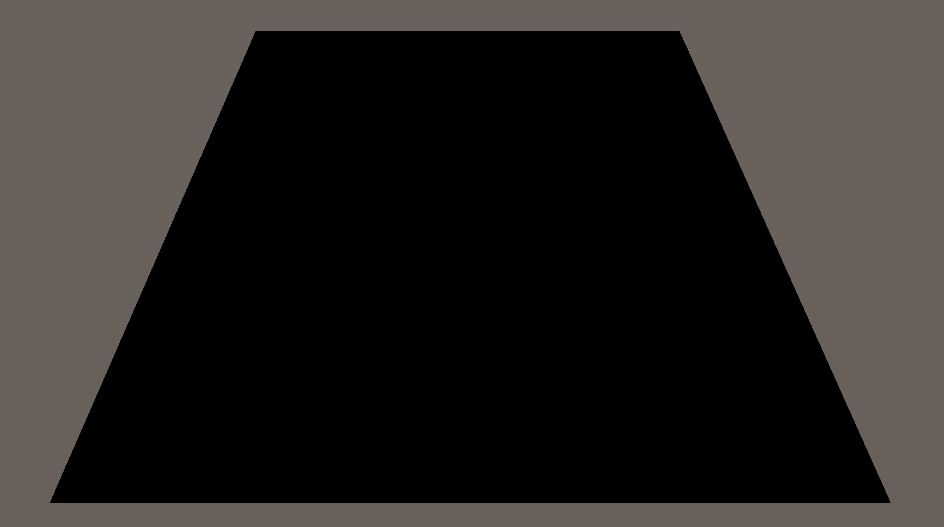
*Figure 3. "floor" of the x axis of the uv coordinates.*

Which is not very interesting... but it makes perfect sense! Since `uv.x` \\(\in [0, 1]\\), `floor(uv.x)` will return `0` (black) for every pixel. To fix this, we will scale the `uv` coordinates by a value we will call `numCells`.

Let's see the result of multiplying `uv` by `numCells = 10`.

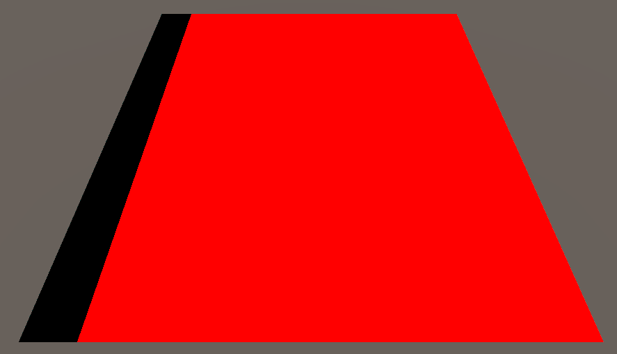
*Figure 4. "floor" of uv.x multiplied by 10".*

We can see that now \\(\frac{1}{10}\\) of the final image is black. This is because the black band has the value `uv.x = 0`, and next to it there is a red band of the same width with value `uv.x = 1`, and so on. Since there is no redder value than `r = 1.0` in LDR (Low dynamic range) colors, the effect is not that obvious. However, if we feed our formula as the hash input, the situation becomes evident.

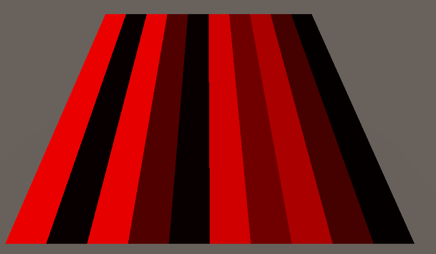
*Figure 5. hash function applied to uv.x.*

Ta-da! Remember we established that the `hash()` function returns a value \\(\in [0, 1]\\), so the black band with value `0` that we saw before has been assigned its own pseudo-random value. We can see this has happened for `uv.x = 1`, `uv.x = 2`, `uv.x = 3`, and so on up to `uv.x = numCells - 1`.

However, our `cells` are a bit stretched vertically... we need to add the value `floor(uv.y)` to `floor(uv.x)`, and that is how we will get the grid pattern we are looking for.

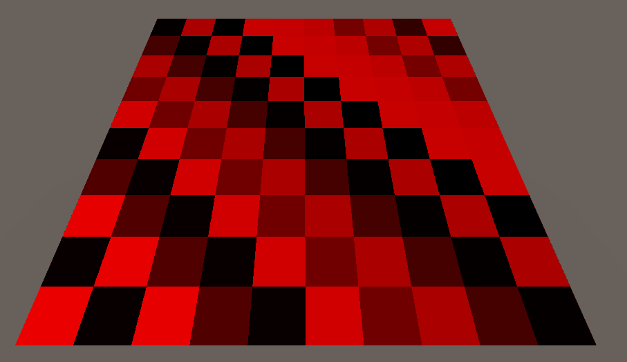
*Figure 6. hash function applied to uv.x + uv.y.*

Now we can clearly see our grid. If you ask me, I would say it looks great, but it clearly has a predictable pattern, and let's not forget our goal is to create a surface of cells with associated pseudo-random values \\(\in [0,1]\\).

This problem is even more evident if we multiply `uv` by `numCells = 100`.

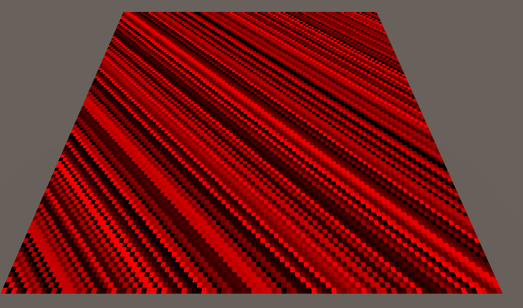

*Figure 7. number of "cells" multiplied by 100.*

However, if we multiply `uv.y` by `numCells + 1`, we get:
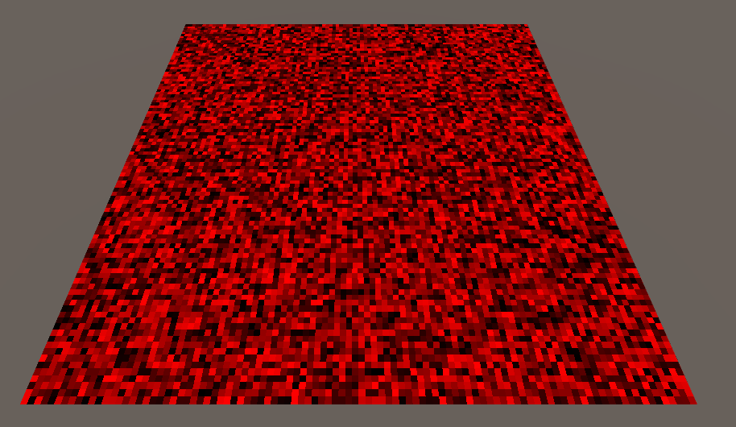
*Figure 8. Magic.*

What? What kind of magic is that? Did that multiplication come to me in a dream? Well, the truth is it comes down to how our formula works (with some help from Francisco Aliaga). We can express the creation of the seed as \\(s(x, y) := x + yt\\) where \\(t\\) is a `uint` constant we can tune to taste.

We want the `seed` not to repeat for two inputs `x, y`. To do this, we need to analyze what it means for two `seed` values to be equal, expressing that equality using the definition of \\(s(x, y)\\).

$$x_1 + y_1t = x_2 + y_2t.$$

If we subtract \\(x_2\\) from both sides and factor out \\(t\\) on the right-hand side we get

$$x_1 - x_2 = t(y_2 - y_1). \tag{1}$$

Now, analyzing the case where \\(y_1 = y_2\\), we notice that

$$x_1 - x_2 = t(y_2 - y_1) = 0 \implies x_1 = x_2.$$

And if \\(x_1 = x_2\\) and \\(y_1 = y_2\\), it means we are talking about the same point \\((x, y)\\), which proves the uniqueness of a seed within a row of the grid.

Now that the \\(y_1 = y_2\\) case is covered, let's move on to the case where \\(y_2 \ne y_1\\) (cells in different rows). The **minimum possible value** of the *absolute value* **of the right-hand side** of equation \\((1)\\) **is \\(t\\)** (in the case \\(y_1 = 0, y_2 = 1\\)). We conclude that:

$$t \le |x_1 - x_2|.$$

It is worth remembering that \\(x_1, x_2 \le\\) `numcells`, so *necessarily* \\(x_1 - x_2 \le\\) `numCells`. We can also conclude that,

$$|x_1 - x_2| \le \mathtt{numCells}.$$

Therefore we have proven that if the seeds are equal for cells in different rows, then \\(t \le\\) `numCells`.

Here we realize we can pick a value of \\(t\\) strictly greater than `numCells`, and that would necessarily force the seeds to be **different**.


## Creating the shells
---

Now that we have our grid of pseudo-random numbers on the surface of our mesh, we can create our first `shell`. To do this we will define the pixel color given the following condition \\((2)\\) :
```glsl
if (rand > 0.005) {
    pixelColor = float3(1.0, 0.0, 0.0); // red
}
else {
    pixelColor = float3(0.0, 0.0, 0.0) // black
}
```

We can see this condition produces the following result:

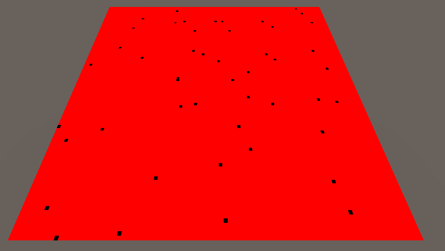
*Figure 9. black dots on the grid.*

It is expected that if `rand` \\(\in [0, 1]\\), most cells will have a value greater than \\(0.005\\) associated with them. We can see this reflected as many red `cells` and few black ones.

Now, as the title of this section suggests, we need to create multiple shells (planes with the shader) to achieve the final effect. To do this we will define a variable called `_NumShells`, which indicates how many shell layers should be created.

Example of 16 instanced shells:
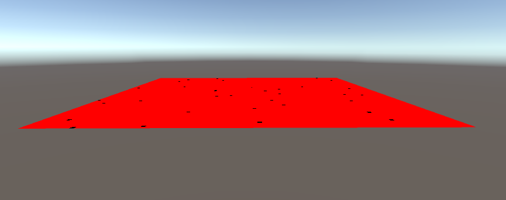

*Figure 10. 16 instanced shells.*

Well... that is not the result one expects, it still looks like a single shell. This is because they all share the same origin point and therefore their vertices are identical. We need to extrude each vertex of the shell by a value we will call `height`.

To define the value of `height` we first need to index each shell with a value `_ShellIndex`, which will be divided by `_NumShells` to obtain a **normalized** `height` value.

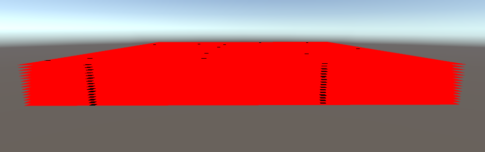
*Figure 11. shells with varying height.*

*y position of the vertices + height*

The magic starts to appear when we replace the arbitrary value `0.005` we had set in condition \\((2)\\) with `height`.

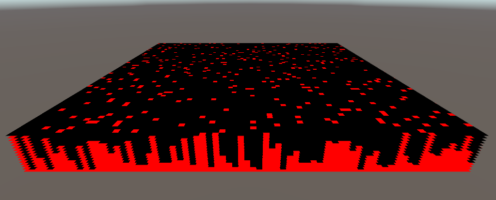
*Figure 12. showing black pixels according to the random value influenced by height.*

Since the `rand` value is in the range \\([0, 1]\\), it is less likely to be greater than `height` when the latter is close to \\(1\\), which is the case for the upper layers.

Although the black pixels of each shell are fantastic for visualizing what is happening behind the scenes, they clearly do not let us see the real effect we are creating, so we will use the GLSL keyword `discard` to remove those pixels and be able to see through them.

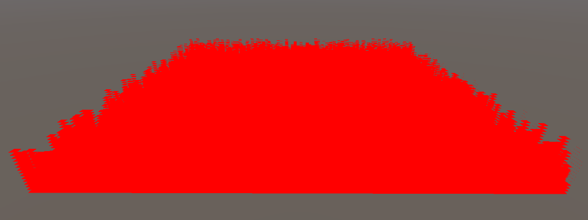

Excellent, the black pixels are gone! However, there is not enough contrast to discern depth between the pixels. But no worries! We can implement a *naive* lighting model by simply multiplying the resulting pixel color by the shell's `height`.

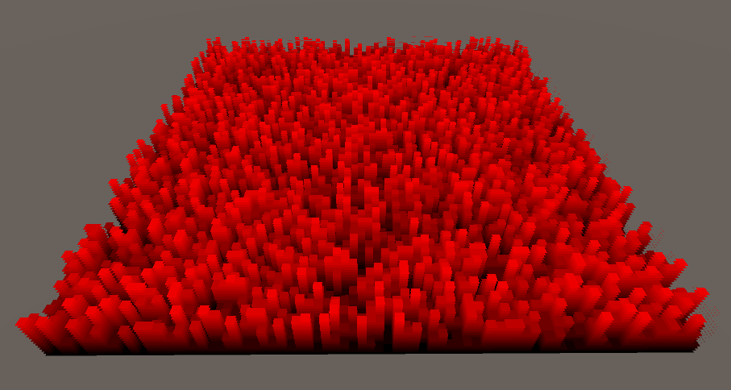 
*Figure 14. pixel color multiplied by the shell height.*

Since the height is \\(0\\) at the base and \\(1\\) at the surface of our shell, the color will increase in intensity linearly. Additionally, within this lighting computation we can raise `height` to an exponent `_LightAttenuation`, to break the linear behavior.

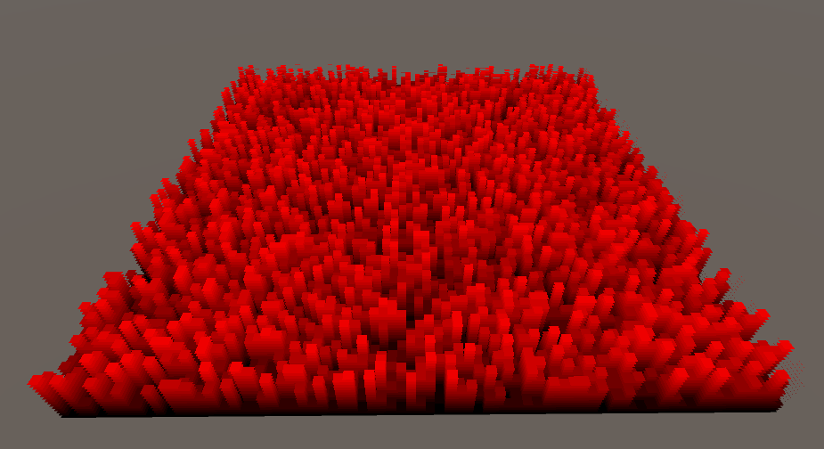
*Figure 15. light attenuation varying from 0 to 10.*

The results we have right now are quite decent, however it is very easy to break the illusion by simply lowering the camera a bit.

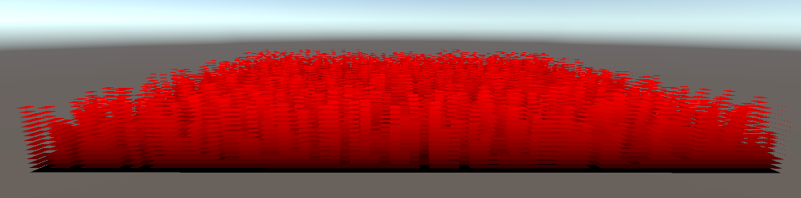
*Figure 16. the effect breaks when lowering the camera.*

We will increase or decrease the separation of the shells by multiplying the `height` value by a value `_ShellsSeparation` \\(\in [0, 10]\\) inside the vertex shader.

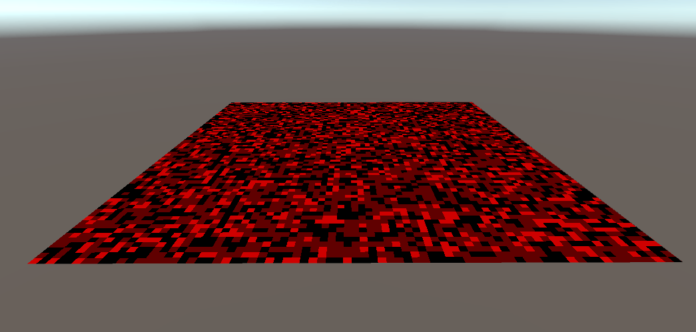
*Figure 17. variation in the separation of the shells.*

*shell separation in action*

If we set `_NumShells` and `_NumCells` to \\(128\\) and adjust the separation between layers to \\(0.75\\), we can get a higher resolution effect.

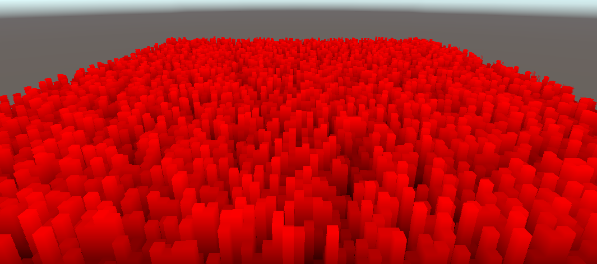
*Figure 18. increase in the resolution of the effect.*


## Grass
---

While the current implementation gets us something similar to what was achieved in *Viva Piñata (2007)*, our Shell Texturing has one big drawback: it only works vertically. If we add the shader to a spherical mesh we get this.

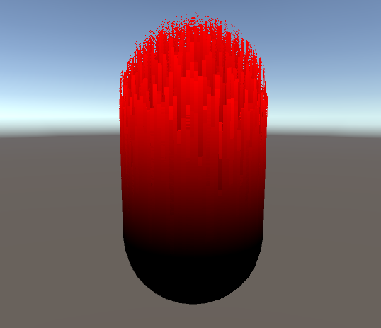

*Figure 20. the shells only grow upwards.*

One would expect the shells to be extruded orthogonally to the faces of the mesh. To achieve that we need to displace the vector position in the direction of the *normal* (and let's not forget to scale the normal by `height` too).

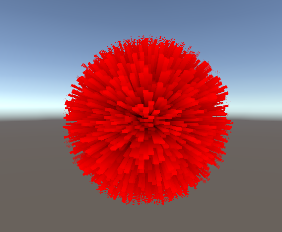
*Figure 21. the shells now grow in the direction of the normal.*

Our sphere looks much better now, though a bit blocky, with a Cube World kind of style. We can improve the effect to get an illusion of blades of grass.

To achieve an effect closer to grass we need to divide the space into segments of `uv` coordinates for each blade of grass. This is the perfect case for the `frac()` function, which returns the decimal part of a floating point number.

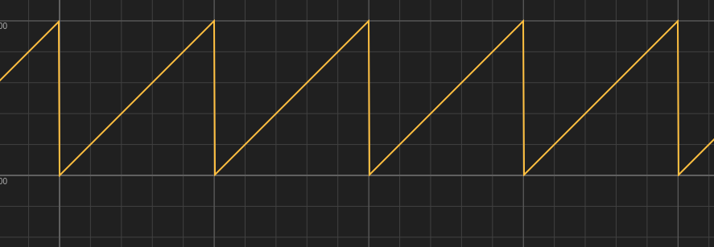
*Figure 22. plot of the fract(x) function made in [graphtoy.com](https://graphtoy.com/?f1(x,t)=frac(x)&v1=true&f2(x,t)=&v2=false&f3(x,t)=&v3=false&f4(x,t)=&v4=false&f5(x,t)=&v5=false&f6(x,t)=&v6=false&grid=1&coords=1.921175863793418,0.21346398486593535,2.3741360268016223).*

If we go back for a moment and return the `uv` coordinates on a plane, we notice how the original `uv` space is visible in the bottom left corner and then it is simply scaled by `_NumCells`.

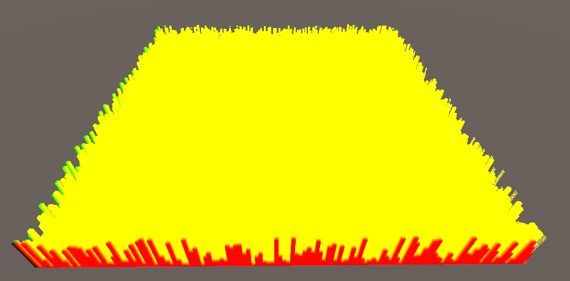
*Figure 23. visualization of the uv coordinates.*

The idea is to repeat the normalized `uv` coordinates across every cell of the grid, and that is why we will use the `frac()` function on the `uv` coordinates, so their components cannot scale beyond \\(1\\) and get confined to the range \\([0, 1]\\).

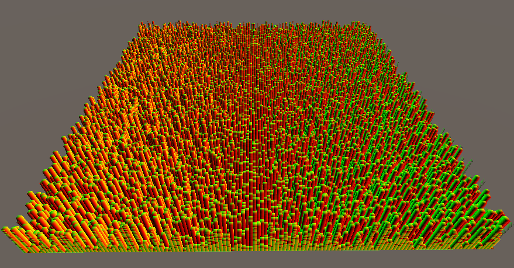

*Figure 24. visualization of frac(uv).*

Mission accomplished, though it is hard to make out the coordinates properly, so we will zoom in to make some surgical adjustments.

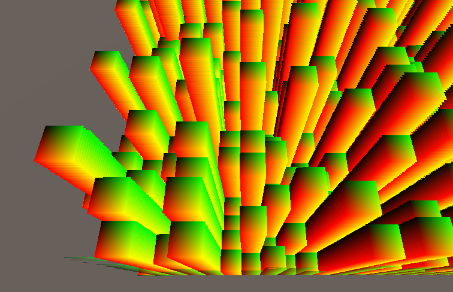

*Figure 25. zoom in to distinguish the fragmented uv coordinates (cell uv).*

First, we can verify that each cell has its own normalized `uv` coordinates, which we will call `cellUv`. We also notice that the origin of the coordinates is at the top left of the cell, which is not desirable for the next operation we will perform, so to move the origin to the center of the cell we will subtract \\(0.5\\) from `cellUv`.

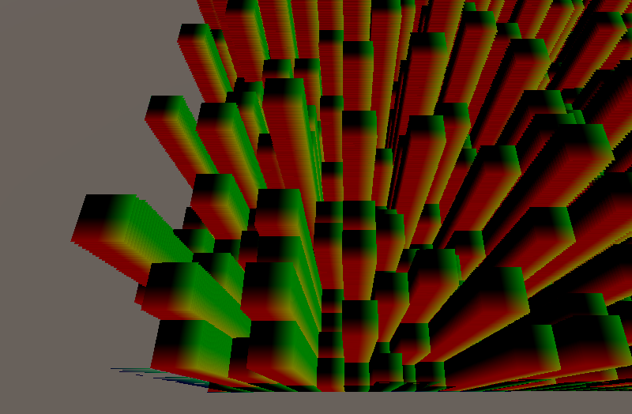

*Figure 26. centered cell uv coordinates.*

With that operation we have effectively centered `cellUv`, however we notice the cells lost brightness. This is because by subtracting \\(0.5\\) from both elements of `cellUv` we have moved the coordinates to the range \\([-0.5, 0.5]\\), which is a bit awkward... so we will multiply `cellUv` by \\(2\\) to set the value of the `cellUv` components within the range \\([-1, 1]\\).

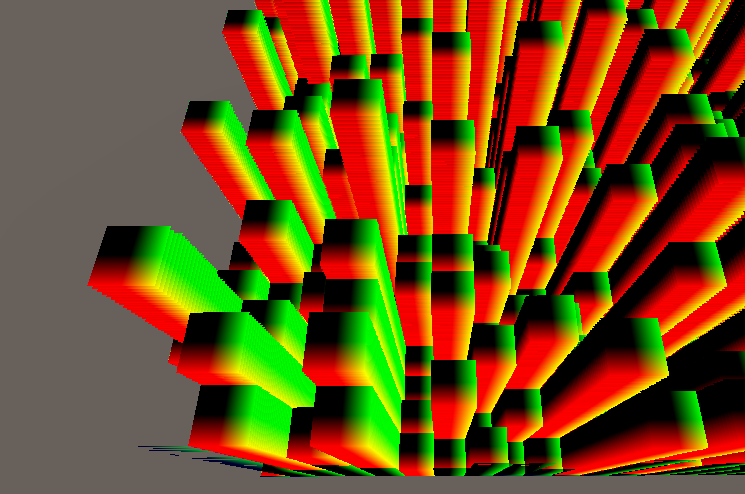

*Figure 27. cell uv multiplied by two.*

Now that we have the `cellUv` origin we can draw a circle very easily, we simply compute the `length()` of each `cellUv` relative to the origin.

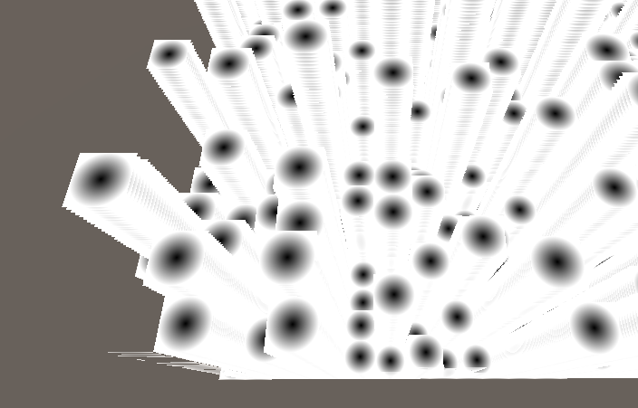

*Figure 28. visualization of length(cellUV).*

Then, with our earlier trick, we discard the pixels if they are greater than a value we will call `_CellThickness` \\(\in [0, 10]\\).

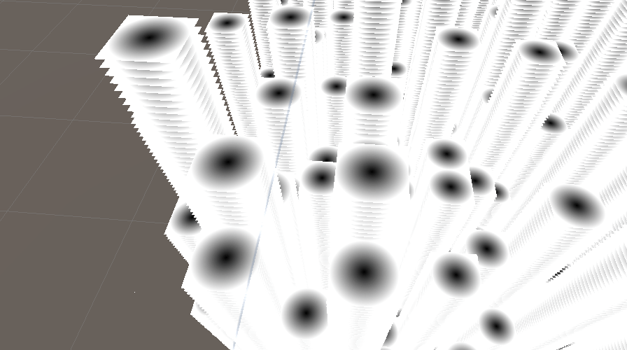
*Figure 29. change in the thickness of each cell uv (Cell thickness varying from 0 to 1.5).*

We set `_CellThicknes` to \\(0.6\\) and return the color to produce the following result:

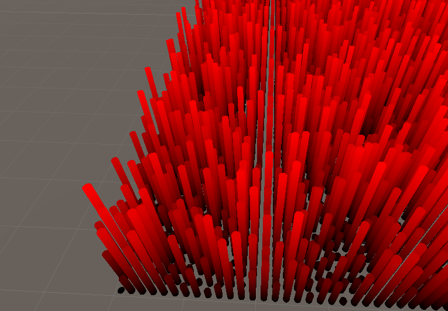

*Figure 30. cylindrical cell uv.*

The grass is clearly cylindrical, which looks fine, but we know that in reality grass has a shape closer to a *cone*. Luckily our `height` variable will come to the rescue once again, this time to attenuate the contribution of `_CellThickness` to the pixel discarding.

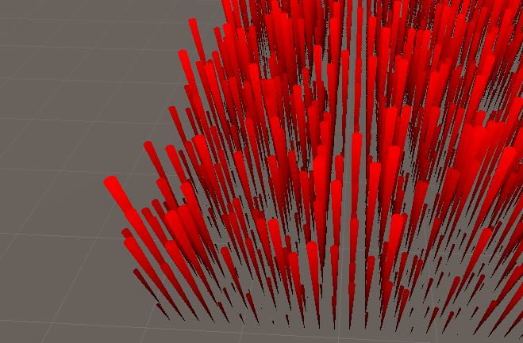

*Figure 31. cell uv thickness attenuated, but the wrong way around.*

Indeed, if we multiply `_CellThickness` by `height` we get a shape reminiscent of a cone, but upside down... to fix this we will multiply `_CellThickness` by `rand - height`

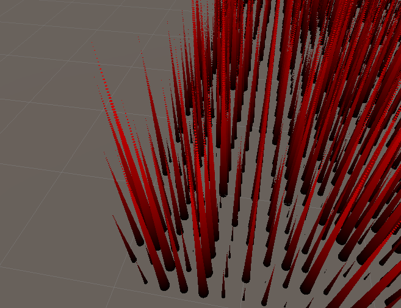

*Figure 32. cell uv thickness correctly attenuated.*

`rand - height` is the "function" that shapes the thickness falloff.

We can add a block on the pixel discarding of the shell whose `_ShellIndex = 0` to avoid the holes at the base.

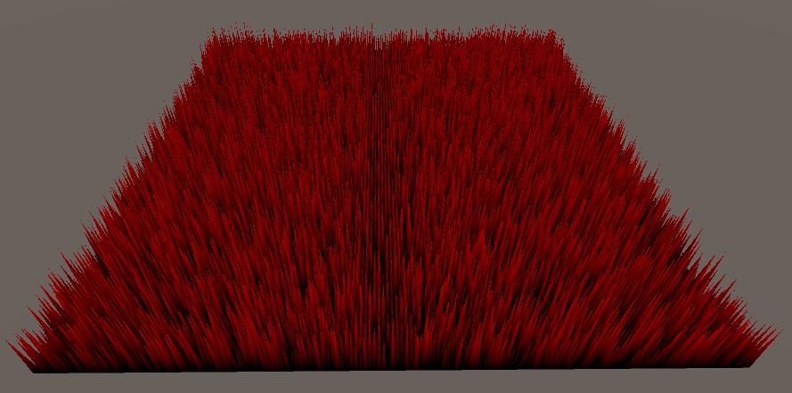
*Figure 33. base added.*

To finish, we can adjust the grass color to a pleasant green, play with the parameters and adjust the camera framing to get a result like this:

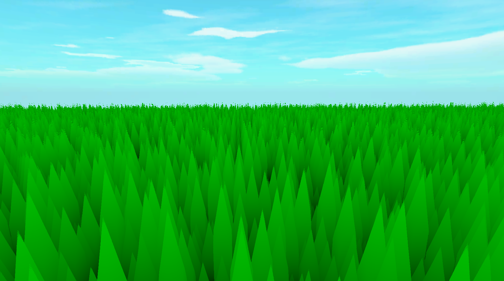
Figure 34. final result, some nice grass.

## Lighting
---

As a final exercise, the lighting model can be improved and further effects added to beautify a final render of the shell texturing technique. For that I will base my work on Adrian Mendez [3] and his implementation of the *Genshin Impact* lighting model.

We will use the sphere to test the lighting model.

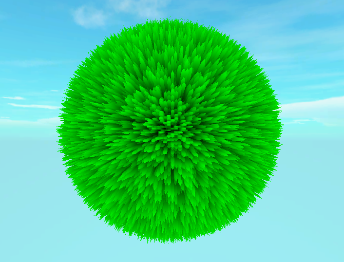

*Figure 35. shells on a sphere with simple lighting.*

We see the sphere with the *naive* lighting model we had implemented before. The first thing we will do to improve the light is define the color of each pixel (\\(P_c\\)) using the classic *Diffuse Lighting Model*.

The value of \\(P_c\\) will be equal to the \\(\cos{\theta}\\) between the surface `normal` of the mesh and a *normalized* vector that **points towards the light**. The computation looks like this:

$$P_c = N_d \cdot L_d.$$

Notice that the dot product is used instead of `cos()` in the equation. This is because of the definition of `dot(x,y)`, which is defined as:

$$\vec{u} \cdot \vec{v} = \left|\vec{u}\right| \left|\vec{v}\right| \cos{\theta}.$$

That is where we can notice that if both vectors are normalized (which is our case), the equation becomes,

$$\vec{u} \cdot \vec{v} = 1 \times 1 \times \cos{\theta}. \\
\vec{u} \cdot \vec{v} = cos \theta. $$

So,
$$\hat{u} \cdot \hat{v} = \cos{\theta}.$$

In Unity, we can get the normalized vector pointing towards the light direction by consulting the *Built-in Shader Variables Manual [4]*, where it is stated that such vector can be accessed with the `_WorldSpaceLight0` variable. It is important that this variable is in *world space*, since if we normalize this vector (strip its magnitude), we will get the direction towards its position from the world origin.

Before showing the result, I will highlight the fact that the range of the \\(\cos{\theta}\\) function is \\((-1 \le \cos{\theta} \le 1)\\) and, since negative light does not exist, the result is *clamped* to the range \\([0, 1]\\). So the final equation becomes:

$$P_c = \max(0, N \cdot \hat{L_p}).$$

Where \\(N\\) is the normal and \\(L_p\\) is the normalized position of the light in world space.

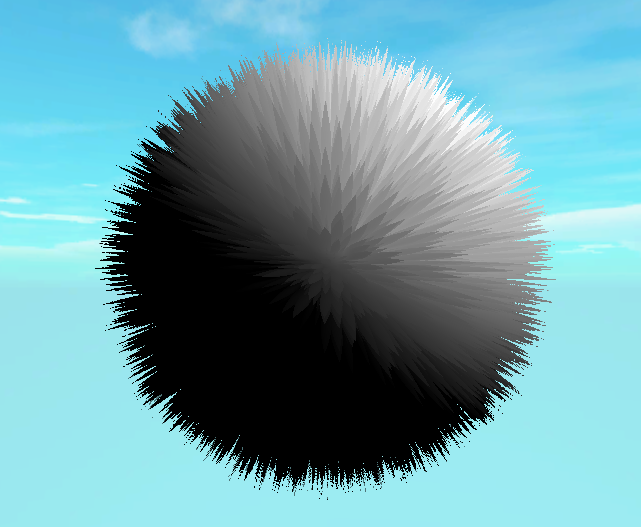

*Figure 36. simple diffuse lightning.*

Now, as a more artistic touch, we will control the transition from black to white with a `smoothstep` between \\(0\\) and a value we will call `_LightSmooth` \\(\in [0, 10]\\).


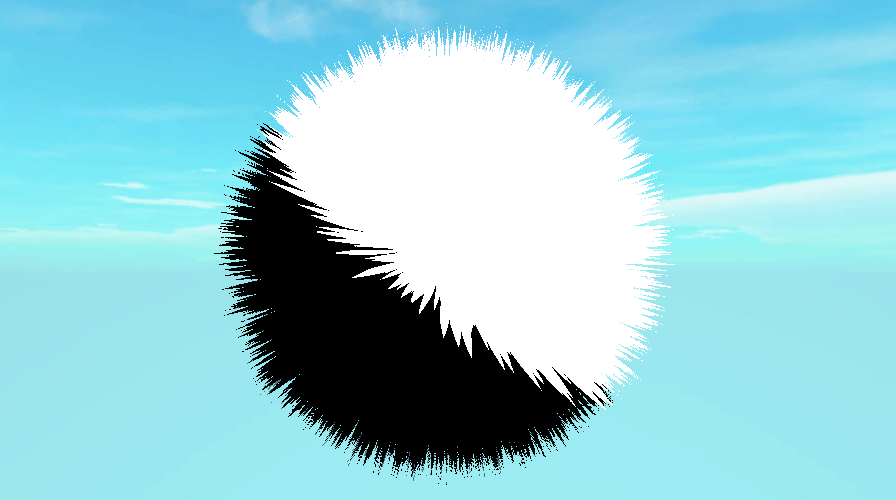
*Figure 37 smoothed diffuse lightning. (Light attenuation varying from 0 to 10).*

*light smooth varying from 0 to 10.

Using the value of our smoothed *diffuse*, we generate a `lerp()` between a shadow color of our choice and a base color.

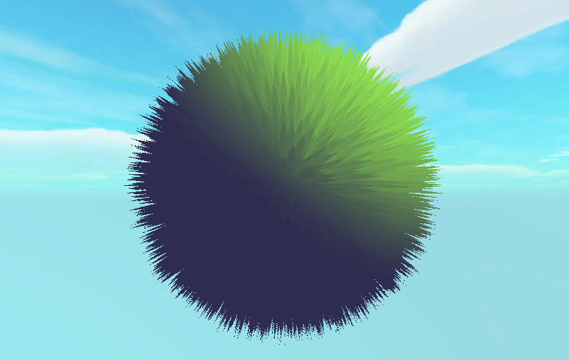

*Figure 38. base and shadow color added with a linear interpolation.*

In my opinion, the shadow looks too *harsh*, so I will follow Acerola's steps in his video about Shell Texturing and apply a *Half lambert diffuse [5]*, which is nothing more than modifying Lambert's diffusion such that,

$$P_c = \max(0, N \cdot \hat{L_p}) \times 0.5 + 0.5.$$

in order to shift the range of \\(P_c\\) from \\([-1, 1]\\) originally to a new range \\([0, 1]\\).

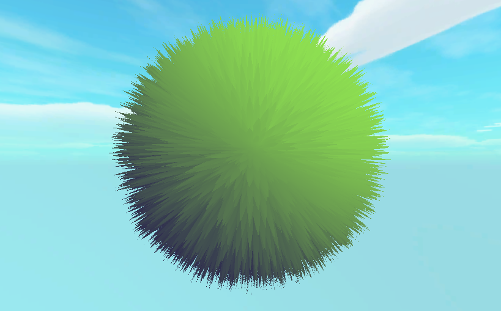

*Figure 39. half lambert applied.*

It is important to mention that the *Half Lambert Diffuse* model is a non physically realistic lighting model [5], since it breaks Lambert's Cosine Law [6].

Additionally, we can add a `_ShadowIntensity` value \\(\in [0, 1]\\) to adjust the intensity of the resulting shadow.

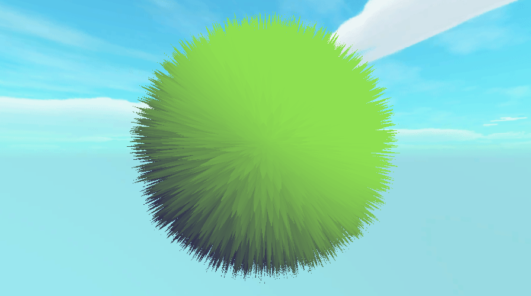
*Figure 40. shadow intensity varying from 0 to 1.*

To finish, we tune the parameters created throughout the blog, look for an interesting model, a skybox that matches the aesthetic, and compose a nice scene =).


*Figure 41. final result. (I used the golden triangle composition).*


## Bibliography
---
[1] G. Gunell "Acerola", “How Are Games Rendering Fur?,” YouTube, Oct. 30, 2023. https://youtu.be/9dr-tRQzij4?si=OBngN7l8wAV_BQ98 (accessed Jun. 27, 2024).

[2] M. Bischoff, “The World’s Simplest Theorem Shows That 8,000 People Globally Have the Same Number of Hairs on Their Head,” Scientific American, Mar. 20, 2023. https://www.scientificamerican.com/article/the-worlds-simplest-theorem-shows-that-8-000-people-globally-have-the-same-number-of-hairs-on-their-head/ (accessed Jun. 13, 2024).


[3] A. Mendez, “Genshin Impact Character Shader Breakdown [Unity URP],” adrianmendez.artstation.com, Feb. 27, 2022. https://adrianmendez.artstation.com/projects/wJZ4Gg (accessed Jun. 27, 2024).

[4] Unity Technologies, “Unity - Manual: Built-in Shader Variables,” docs.unity3d.com. https://docs.unity3d.com/Manual/SL-UnityShaderVariables.html (accessed Jun. 27, 2024).

[5] Valve, “Half Lambert - Valve Developer Community,” developer.valvesoftware.com, Jan. 07, 2024. https://developer.valvesoftware.com/wiki/Half_Lambert (accessed Jun. 28, 2024).

[6] Wikipedia Contributors, “Lambert’s Cosine Law,” Wikipedia, Jan. 29, 2021. https://en.wikipedia.org/wiki/Lambert%27s_cosine_law (accessed Jun. 28, 2024).
